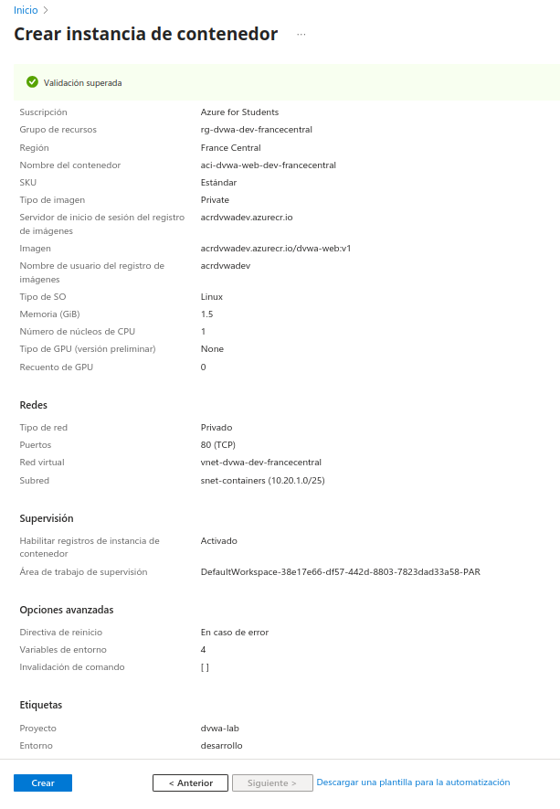
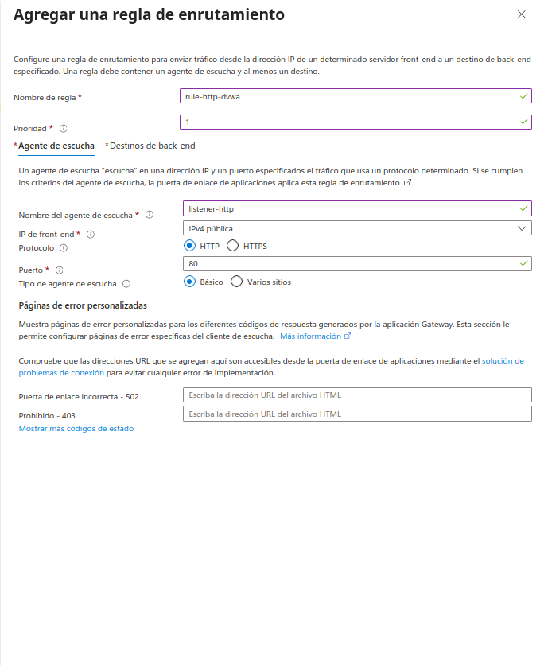
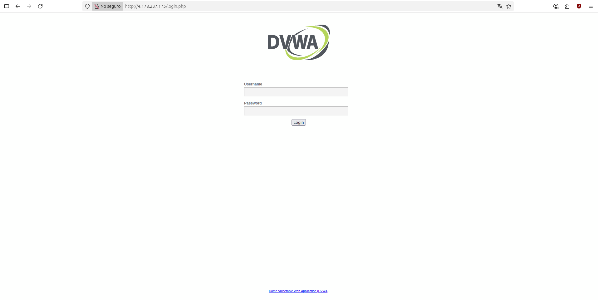

# Documentación Técnica: Despliegue de Arquitectura Web Segura en Azure

## 1. Introducción

Este documento detalla el proceso de diseño y despliegue de una aplicación web siguiendo un patrón de **arquitectura de 3 capas** en un entorno de Microsoft Azure. El objetivo es demostrar la implementación de una infraestructura segura y segmentada, combinando servicios PaaS de Azure y contenedores Docker para simular un entorno empresarial realista.

---

## 2. Fase de Planificación e Infraestructura Base

Todo despliegue robusto comienza con una planificación sólida de la organización y la red.

### 2.1. Creación y Organización del Grupo de Recursos

El primer paso es crear un **Grupo de Recursos** que actuará como un contenedor lógico para todos los servicios del proyecto. Se ha seguido una convención de nomenclatura profesional (`rg-dvwa-dev-francecentral`) para identificar el tipo de recurso (rg), la aplicación (dvwa), el entorno (dev) y la región.

### 2.2. Aplicación de Gobernanza mediante Etiquetas

Desde el inicio, se aplican **Etiquetas (Tags)** al Grupo de Recursos. Esta práctica es crucial en entornos empresariales para la gestión de costes, la automatización y la asignación de responsabilidades.

---

## 3. Fase de Diseño y Segmentación de la Red

El pilar de una arquitectura segura es una red bien diseñada. Se ha creado una Red Virtual (VNet) con un espacio de direcciones planificado para albergar todos los componentes de forma aislada.

### 3.1. Planificación del Espacio de Direcciones y Subredes

Se definió un espacio de direcciones `10.20.0.0/23`, lo que proporciona un total de 512 IPs. Este espacio se ha dividido meticulosamente en cuatro subredes `/25` (128 IPs cada una), asignando a cada una un propósito específico para garantizar la **segmentación de la red**.

### 3.2. Verificación de la Topología de Red

La pestaña de resumen confirma la correcta configuración de la VNet y sus cuatro subredes (`snet-appgateway`, `snet-jumpbox`, `snet-containers`, `snet-database`) antes de su creación.

---

## 4. Fase de Despliegue de Servicios

Con la red ya definida, se procede a desplegar los servicios principales de la arquitectura.

### 4.1. Servidor de Base de Datos (MySQL)

Se optó por un servicio PaaS **Azure Database for MySQL (Servidor Flexible)**. La configuración clave es el **"Acceso privado"**, que integra el servidor en la subred `snet-database`, asegurando que no sea accesible desde internet.

### 4.2. Punto de Acceso Administrativo (Jump Box)

Para administrar una base de datos privada, es indispensable un punto de acceso seguro. Se desplegó una **Máquina Virtual (Jump Box)** en su propia subred (`snet-jumpbox`).

### 4.3. Creación y Verificación de la Base de Datos

Tras conectar a la Jump Box por SSH, se estableció una conexión con el servidor MySQL para crear la base de datos `dvwa`. Esta prueba fue crucial para **validar la correcta configuración de la red y la resolución de DNS privado**.

### 4.4. Registro de Contenedores (Azure Container Registry)

Para alojar la imagen de Docker personalizada de la aplicación, se desplegó un **Azure Container Registry (ACR)**.

### 4.5. Flujo de Trabajo Local-a-Nube

Esta captura demuestra el ciclo de vida completo de una imagen de contenedor: autenticación con Azure, etiquetado de la imagen local y subida (`docker push`) al registro privado en la nube.

### 4.6. Habilitación del Acceso al Registro

Como paso final de la preparación, se habilitó el **Usuario Administrador** en el ACR. Este paso es necesario para simplificar la autenticación desde otros servicios de Azure (como ACI).

---

## 5. Fase de Despliegue de la Aplicación

### 5.1. Instancia de Contenedor (ACI)

La aplicación se despliega en una **Azure Container Instance (ACI)** a partir de la imagen alojada en ACR. Se despliega en su subred privada (`snet-containers`) y sin IP pública.

### 5.2. Inyección Segura de la Configuración

La conexión a la base de datos se configura mediante **variables de entorno**, siguiendo las mejores prácticas para la gestión de secretos. Se presta especial atención al formato correcto del usuario (`usuario@servidor`) y se marca la contraseña como "segura".

---

## 6. Fase de Configuración del Gateway

El último componente es el **Azure Application Gateway**, que actúa como reverse proxy.

### 6.1. Creación de la Regla de Enrutamiento

Se define una **Regla de Enrutamiento** que conecta un "Agente de escucha" (Listener) en el puerto 80 con el grupo de back-end.

### 6.2. Configuración del Grupo de Back-end

El **Grupo de back-end** se configura para apuntar a la dirección IP privada de la Instancia de Contenedor, creando el vínculo entre el gateway y la aplicación.

### 6.3. Verificación de la Arquitectura del Gateway

La pantalla de resumen consolida toda la configuración del Application Gateway antes de su despliegue.

---

## 7. Fase de Depuración y Puesta en Marcha

Tras el despliegue inicial, la aplicación no podía conectar a la base de datos. El proceso de diagnóstico demostró que la causa era un requisito de conexión SSL por defecto en el servidor de Azure. Como paso final de la depuración, este requisito se desactivó temporalmente para validar la conectividad.

---

## 8. Resultado Final

Una vez solucionado el problema de conexión, el acceso a través de la IP pública del Application Gateway se realizó con éxito. La siguiente imagen muestra la página de login de DVWA, validando el correcto funcionamiento de la arquitectura completa.

